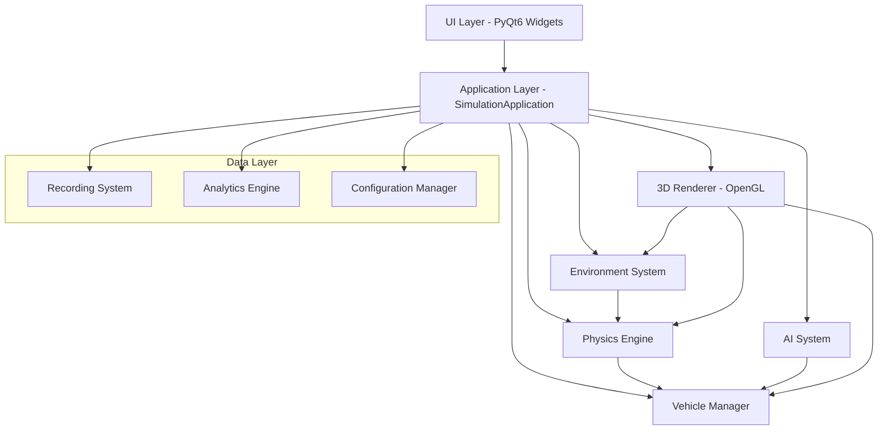

# Design Document

## Overview

The Robotic Car Simulation Application is architected as a modular, event-driven system built on PyQt6 with OpenGL-accelerated 3D rendering. The design follows a layered architecture with clear separation of concerns between the presentation layer (UI), application layer (simulation control), domain layer (physics, AI, vehicles), and infrastructure layer (rendering, I/O).

The system is designed to handle real-time simulation of multiple autonomous vehicles with sophisticated physics, AI decision-making, and comprehensive data collection capabilities. The architecture supports extensibility through plugin-like components and maintains high performance through optimized rendering and physics calculations.

## Architecture

### System Architecture Overview



### Core Components Architecture

The system is built around several core subsystems that communicate through Qt's signal-slot mechanism:

1. **SimulationApplication**: Central coordinator managing simulation state and component lifecycle
2. **PhysicsEngine**: Real-time physics simulation with vehicle dynamics and collision detection
3. **VehicleManager**: Vehicle lifecycle management and control input processing
4. **AISystem**: Autonomous behavior processing with behavior trees and decision-making
5. **Environment**: World state management including weather, traffic, and dynamic objects
6. **RenderEngine**: 3D visualization using OpenGL with multiple camera modes
7. **UIManager**: Interface management with dockable panels and responsive layouts

### Threading Model

The application uses a multi-threaded approach to maintain responsive UI and smooth simulation:

- **Main Thread**: UI rendering and user interaction
- **Simulation Thread**: Physics calculations and AI processing
- **Render Thread**: 3D scene rendering and OpenGL operations
- **Data Thread**: Recording, analytics, and file I/O operations

## Components and Interfaces

### Core Simulation Components

#### SimulationApplication
```python
class SimulationApplication(QObject):
    # Signals for state changes
    simulation_started = pyqtSignal()
    simulation_paused = pyqtSignal()
    frame_updated = pyqtSignal(float)  # delta_time
    
    # Core subsystem management
    def start_simulation()
    def pause_simulation()
    def reset_simulation()
    def set_simulation_speed(float)
    def get_performance_stats() -> Dict[str, Any]
```

#### Enhanced Physics Engine
```python
class PhysicsEngine(QObject):
    collision_detected = pyqtSignal(object, object)
    
    # Multi-surface physics support
    def set_surface_properties(surface_type: str, friction: float, restitution: float)
    def set_weather_conditions(weather_type: str, intensity: float)
    def add_dynamic_obstacle(obstacle: PhysicsObject)
    
    # Advanced vehicle dynamics
    def calculate_tire_forces_advanced(vehicle: VehiclePhysics) -> TireForces
    def simulate_suspension_dynamics(vehicle: VehiclePhysics, dt: float)
    def apply_aerodynamic_effects(vehicle: VehiclePhysics) -> Vector3
```

#### Vehicle Management System
```python
class VehicleManager(QObject):
    vehicle_spawned = pyqtSignal(str)  # vehicle_id
    vehicle_destroyed = pyqtSignal(str)
    
    def spawn_vehicle(vehicle_type: str, position: Vector3, ai_config: Dict) -> str
    def customize_vehicle(vehicle_id: str, customization: VehicleCustomization)
    def set_vehicle_ai_behavior(vehicle_id: str, behavior_tree: BehaviorTree)
    def get_vehicle_telemetry(vehicle_id: str) -> VehicleTelemetry
```

#### AI and Behavior System
```python
class AISystem(QObject):
    decision_made = pyqtSignal(str, dict)  # vehicle_id, decision
    
    def create_behavior_tree(tree_definition: Dict) -> BehaviorTree
    def update_vehicle_ai(vehicle_id: str, sensor_data: Dict, dt: float)
    def train_ml_model(training_data: List[TrainingExample])
    def evaluate_model_performance(model: MLModel, test_scenarios: List[Scenario])
```

### 3D Rendering System

#### OpenGL Renderer
```python
class RenderEngine(QOpenGLWidget):
    def __init__(self):
        # Shader management
        self.shader_manager = ShaderManager()
        self.lighting_system = LightingSystem()
        self.particle_system = ParticleSystem()
        
        # Camera system
        self.camera_manager = CameraManager()
        self.camera_modes = ['first_person', 'third_person', 'top_down', 'free_roam']
    
    def render_scene(self, scene_data: SceneData)
    def set_camera_mode(self, mode: str, target_vehicle: str = None)
    def add_visual_effect(self, effect_type: str, parameters: Dict)
    def capture_screenshot(self, resolution: Tuple[int, int]) -> QImage
```

#### Scene Management
```python
class SceneManager:
    def __init__(self):
        self.scene_graph = SceneGraph()
        self.material_library = MaterialLibrary()
        self.mesh_cache = MeshCache()
    
    def load_environment(self, environment_file: str)
    def add_dynamic_object(self, obj: RenderableObject)
    def update_object_transform(self, obj_id: str, transform: Matrix4x4)
    def set_lighting_conditions(self, time_of_day: float, weather: WeatherConditions)
```

### User Interface Components

#### Main Window Architecture
```python
class MainWindow(QMainWindow):
    def __init__(self, simulation_app: SimulationApplication):
        self.simulation_app = simulation_app
        self.ui_manager = UIManager()
        self.dock_manager = DockManager()
        
        # Core UI panels
        self.viewport_3d = Viewport3D()
        self.control_panel = ControlPanel()
        self.telemetry_panel = TelemetryPanel()
        self.behavior_editor = BehaviorEditor()
        self.map_editor = MapEditor()
        self.challenge_panel = ChallengePanel()
```

#### Visual Programming Interface
```python
class BehaviorEditor(QWidget):
    def __init__(self):
        self.block_library = BlockLibrary()
        self.canvas = BehaviorCanvas()
        self.code_generator = CodeGenerator()
    
    def create_behavior_block(self, block_type: str) -> BehaviorBlock
    def connect_blocks(self, source: BehaviorBlock, target: BehaviorBlock)
    def generate_code(self) -> str
    def validate_behavior_tree(self) -> ValidationResult
```

### Data Management Components

#### Recording System
```python
class RecordingSystem(QObject):
    recording_started = pyqtSignal()
    recording_stopped = pyqtSignal()
    
    def start_recording(self, recording_config: RecordingConfig)
    def stop_recording(self) -> RecordingMetadata
    def replay_recording(self, recording_file: str)
    def export_recording(self, format: str, output_path: str)
```

#### Analytics Engine
```python
class AnalyticsEngine(QObject):
    def __init__(self):
        self.metrics_collector = MetricsCollector()
        self.performance_analyzer = PerformanceAnalyzer()
        self.safety_analyzer = SafetyAnalyzer()
    
    def collect_telemetry(self, vehicle_data: VehicleTelemetry)
    def analyze_performance(self, session_data: SessionData) -> PerformanceReport
    def generate_safety_report(self, scenario_data: ScenarioData) -> SafetyReport
```

## Data Models

### Core Data Structures

#### Vehicle Data Model
```python
@dataclass
class VehicleConfiguration:
    vehicle_type: str
    mass: float
    engine_power: float
    max_torque: float
    dimensions: Vector3
    color: Tuple[float, float, float]
    sensor_config: SensorConfiguration

@dataclass
class VehicleTelemetry:
    timestamp: float
    position: Vector3
    velocity: Vector3
    acceleration: Vector3
    rotation: float
    steering_angle: float
    throttle: float
    brake: float
    sensor_readings: Dict[str, Any]
    ai_state: Dict[str, Any]
```

#### Environment Data Model
```python
@dataclass
class EnvironmentState:
    time_of_day: float  # 0.0 to 24.0
    weather_conditions: WeatherConditions
    traffic_density: float
    surface_conditions: Dict[str, SurfaceProperties]
    dynamic_objects: List[DynamicObject]

@dataclass
class WeatherConditions:
    weather_type: str  # 'clear', 'rain', 'snow', 'fog'
    intensity: float  # 0.0 to 1.0
    wind_speed: float
    wind_direction: Vector3
    visibility: float  # meters
```

#### AI and Behavior Models
```python
@dataclass
class BehaviorNode:
    node_type: str  # 'condition', 'action', 'composite'
    parameters: Dict[str, Any]
    children: List['BehaviorNode']
    
@dataclass
class SensorData:
    camera_data: CameraReading
    lidar_data: LidarReading
    ultrasonic_data: List[UltrasonicReading]
    gps_data: GPSReading
    imu_data: IMUReading
```

### Persistence Models

#### Configuration Management
```python
class ConfigurationManager:
    def save_vehicle_preset(self, preset_name: str, config: VehicleConfiguration)
    def load_vehicle_preset(self, preset_name: str) -> VehicleConfiguration
    def save_environment_preset(self, preset_name: str, env: EnvironmentState)
    def save_user_preferences(self, preferences: UserPreferences)
```

#### Session Data
```python
@dataclass
class SimulationSession:
    session_id: str
    start_time: datetime
    end_time: datetime
    vehicles: List[VehicleConfiguration]
    environment: EnvironmentState
    challenges_completed: List[ChallengeResult]
    performance_metrics: PerformanceMetrics
```

## Error Handling

### Exception Hierarchy
```python
class SimulationError(Exception):
    """Base exception for simulation errors"""
    pass

class PhysicsError(SimulationError):
    """Physics calculation errors"""
    pass

class RenderingError(SimulationError):
    """3D rendering errors"""
    pass

class AIError(SimulationError):
    """AI system errors"""
    pass

class ConfigurationError(SimulationError):
    """Configuration and setup errors"""
    pass
```

### Error Recovery Strategies

1. **Physics Errors**: Automatic simulation reset with last known good state
2. **Rendering Errors**: Fallback to lower quality rendering modes
3. **AI Errors**: Switch to default behavior patterns
4. **Memory Errors**: Automatic garbage collection and resource cleanup
5. **File I/O Errors**: Graceful degradation with user notification

### Logging and Diagnostics
```python
class DiagnosticsSystem:
    def __init__(self):
        self.logger = logging.getLogger('RoboSim')
        self.performance_monitor = PerformanceMonitor()
        self.error_reporter = ErrorReporter()
    
    def log_performance_metrics(self, metrics: Dict[str, float])
    def report_error(self, error: Exception, context: Dict[str, Any])
    def generate_diagnostic_report(self) -> DiagnosticReport
```

## Testing Strategy

### Unit Testing Framework
- **Physics Engine**: Test individual force calculations, collision detection algorithms
- **AI System**: Test behavior tree execution, decision-making logic
- **Vehicle Manager**: Test vehicle spawning, customization, control input processing
- **Rendering System**: Test shader compilation, scene graph operations

### Integration Testing
- **Component Communication**: Test signal-slot connections between major components
- **Data Flow**: Test data consistency across simulation updates
- **Performance**: Test frame rate stability under various load conditions

### Simulation Testing
- **Scenario Testing**: Automated testing of predefined driving scenarios
- **Regression Testing**: Ensure physics behavior remains consistent across updates
- **Stress Testing**: Test system stability with maximum vehicle counts and complex environments

### User Interface Testing
- **Usability Testing**: Test interface responsiveness and workflow efficiency
- **Accessibility Testing**: Test keyboard navigation and screen reader compatibility
- **Cross-Platform Testing**: Ensure consistent behavior across different operating systems

### Test Data Management
```python
class TestDataManager:
    def create_test_scenario(self, scenario_config: Dict) -> TestScenario
    def generate_test_vehicles(self, count: int) -> List[VehicleConfiguration]
    def create_reference_recordings(self, scenarios: List[TestScenario])
    def validate_simulation_output(self, actual: SimulationResult, expected: SimulationResult) -> bool
```

### Continuous Integration
- Automated test execution on code changes
- Performance regression detection
- Cross-platform compatibility verification
- Documentation generation and validation

## Performance Considerations

### Optimization Strategies

1. **Physics Optimization**:
   - Spatial partitioning for collision detection
   - Level-of-detail physics for distant objects
   - Predictive collision avoidance

2. **Rendering Optimization**:
   - Frustum culling and occlusion culling
   - Level-of-detail rendering
   - Instanced rendering for similar objects
   - Texture atlasing and compression

3. **Memory Management**:
   - Object pooling for frequently created/destroyed objects
   - Streaming of large environment assets
   - Garbage collection optimization

4. **Multi-threading**:
   - Parallel physics calculations
   - Asynchronous AI processing
   - Background data recording and analysis

### Scalability Design

The system is designed to scale from single-vehicle testing to complex multi-vehicle scenarios:

- **Dynamic LOD**: Automatic quality adjustment based on system performance
- **Distributed Processing**: Support for offloading AI calculations to separate processes
- **Modular Loading**: On-demand loading of environment assets and vehicle models
- **Configurable Quality**: User-adjustable quality settings for different hardware capabilities